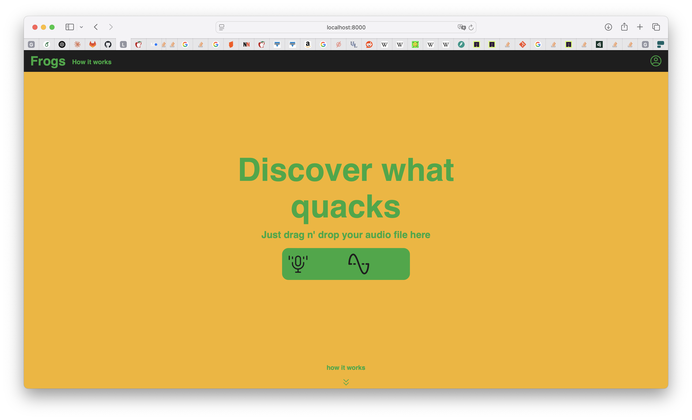

<br/>
<div align="center">
<a href="https://github.com/amarcelq/dapi_amphibien/">

</a>
<h3 align="center">Frogs</h3>
<p align="center">
A web application to discover different frogs in a recording


  


</p>
</div>

## About The Project



This project is a research project, trying to separate unique frog calls from one recording. 
### Built With

This section should list any major frameworks/libraries used to bootstrap your project. Leave any add-ons/plugins for the acknowledgements section. Here are a few examples.

- [Django](https://www.djangoproject.com)
- [Docker](https://www.docker.com)
- [wavesurfer.js](https://wavesurfer.xyz)
- [Celery](https://docs.celeryq.dev/en/stable/)
- [Redis](https://redis.io)
- [FastAPI](https://fastapi.tiangolo.com)
## Getting Started

This is an example of how you may give instructions on setting up your project locally.
To get a local copy up and running follow these simple example steps.
### Prerequisites

You need a working docker deamon installed and running. Confirm with `docker -v`.

In some cases it could be necessary to install the dependencies manually (e.g. when developing).

- Django Requirements
  ```sh
  uv sync
  ```
- JS/CSS Requirements
  ```sh
  cd assets
  yarn
  ```
- Audio Processing Requirements
  ```sh
  cd audio_processing
  uv sync
  ```

### Installation

1. Clone the repo
   ```sh
   git clone https://github.com/amarcelq/dapi_amphibien.git
   ```
2. Copy the `.env.example` file into `.env`. You dont _have_ to change something in it, but you _should_ change things like DB passwords and the secure keys.
   ```sh
   cp .env.example .env
   ```
3. Start everything using docker compose
   ```sh
   docker compose up -d --build
   ```
4. Now everything should be up and running and you should see the application at `localhost:8000`!
## Usage

Use this space to show useful examples of how a project can be used. Additional screenshots, code examples and demos work well in this space. You may also link to more resources.

_For more examples, please refer to the [Documentation](https://example.com)_

## How it works and what we've tried
idkdidkidk

## Future Steps
...

## License

Distributed under the MIT License. See [MIT License](https://opensource.org/licenses/MIT) for more information.
## Acknowledgments

Here are some ressources we used to create this project. Make sure to check them out!

- [makeread.me](https://github.com/ShaanCoding/ReadME-Generator)
- [othneildrew](https://github.com/othneildrew/Best-README-Template)
- [Django Docker Template](https://github.com/nickjj/docker-django-example)