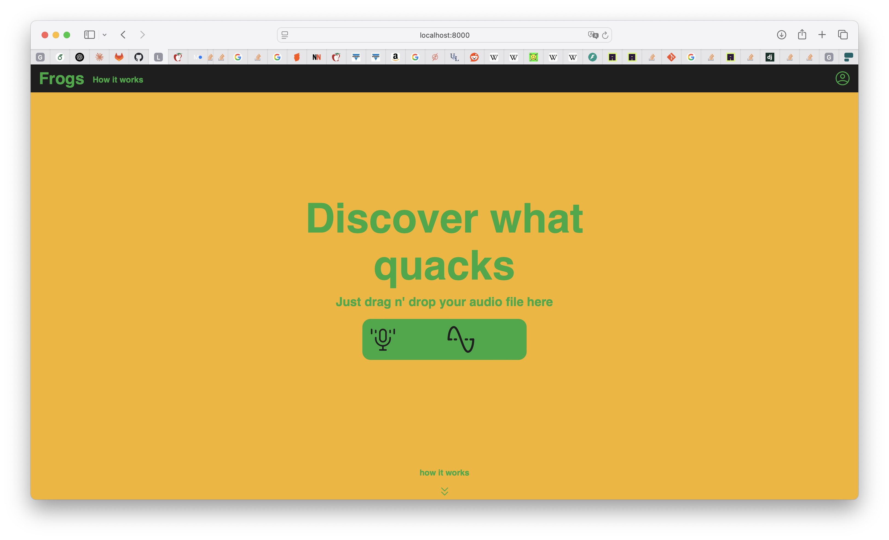
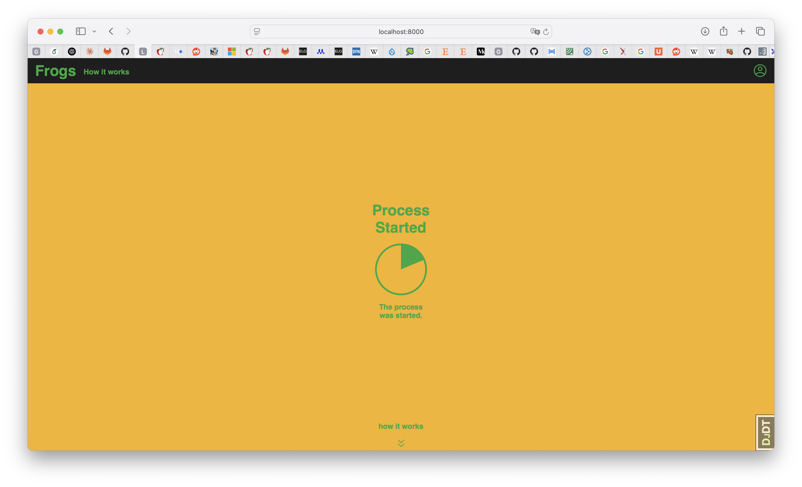

<br/>
<div align="center">
<a href="https://github.com/amarcelq/dapi_amphibien/">

</a>
<h3 align="center">Frogs</h3>
<p align="center">
A web application to discover different frogs in a recording
<br/>
<br/>
<a href="#getting-started"><strong>Getting Started »</strong></a>
<a href="#how-it-works-and-what-weve-tried"><strong>How it works »</strong></a>
<a href="#future-steps"><strong>Future Steps »</strong></a>

  


</p>
</div>

## About The Project



This project is a research project, trying to separate unique frog calls from one recording. 
### Built With
- [Django](https://www.djangoproject.com)
- [Docker](https://www.docker.com)
- [wavesurfer.js](https://wavesurfer.xyz)
- [Celery](https://docs.celeryq.dev/en/stable/)
- [Redis](https://redis.io)
- [FastAPI](https://fastapi.tiangolo.com)
## Getting Started
This shows how you can setup the project on your own environment.

### Prerequisites

You need a working docker deamon installed and running. Confirm with `docker -v`.

In some cases it could be necessary to install the dependencies manually (e.g. when developing).

- Django Requirements
  ```sh
  uv sync
  ```
- JS/CSS Requirements
  ```sh
  cd assets
  yarn
  ```
- Audio Processing Requirements
  ```sh
  cd audio_processing
  uv sync
  ```

### Installation

1. Clone the repo
   ```sh
   git clone https://github.com/amarcelq/dapi_amphibien.git
   ```
2. Copy the `.env.example` file into `.env`. You dont _have_ to change something in it, but you _should_ change things like DB passwords and the secure keys.
   ```sh
   cp .env.example .env
   ```
3. Start everything using docker compose
   ```sh
   docker compose up -d --build
   ```
4. If its the first time starting it, you have to initialise the Database and Django schemas. Run the following commands:
   ```sh
   ./run manage makemigrations
   ./run manage migrate
5. Now everything should be up and running and you should see the application at `localhost:8000`!
## Usage

When the page is running, drag n' drop a sound file (`.wav`) onto the green box. The site will begin processing it showing a progress bar. 

After it is done progressing, it will show the originial recording, as well as all found clusters of sound. Those should be frogs, but it can also happen that other sounds find their way there. Just Click on the wave forms to listen to a sample of them. To see all samples of one cluster, exapnd the tile by clicking on "Show more". 

## How It Works
### Frontend + Backend 
The whole application is dockerized, enabling easy deploying and starting. It uses the following containers:
- web
  This Container contains the Django application and thus manages all requests and request handling. It invokes the audio backend, as well as kicks of the tasks in Celery.
- worker
  This is the Celery worker, that handles the background tasks and processes for Django
- audio
  In this container the audio backends runs behind a FastAPI instance on uvicorn. This async server allows the processing of the audio data. (Could be also delegated to a dedicated task queue, but that wasnt necesarry for this scope)
- Redis
  - This is the message broker for Celery
- Postgres DB
  - This is used by Django to manage Sessions. In the future it can be easily used to store users and their info.
- app, asset, js & css
  - Those are containers used for building or during developement. They build & bundle the JavaScript and CSS files, as well as manage the python dependencies for Django.

As there is no login required right now, the identification of users is handled via (anonymous) sessions. When a user uploads a file, it is stored on a `media` volume in the docker compose stack, and the audio processing backend is called via a FastAPI route. The client can get progress updates via a seperate route. Once finished, the client gets the resulting `.wav`-file paths and the frontend renders the corresponding tiles.

### Audio Processing Backend
> Note: This program is designed to function with or without the website interface. Refer to `audio_processing/main.py` for core logic. This README focuses on the website implementation.
1. Receive the input frog mixture from the web interface.  
2. Apply denoising and optional preprocessing steps such as trimming and converting to mono.  
3. Perform sound separation using breadth-first search with ConvTasNet, generating two splits. Evaluate each split’s "frogginess" by measuring its Euclidean distance to the mean froggy vector versus the mean non-froggy vector (means computed from multiple frog recordings and random non-frog sounds; see `audio_processing/data/utils.py`).  
   - If froggy, expand the branch until max depth is reached.  
   - If not froggy, terminate the branch.  
   Pretrained PyTorch weights are fine-tuned to distinguish anuran calls from other sounds. Training data includes Kaggle’s Anuran dataset mixed with various pond, church bell, and car sounds from YouTube (see `audio_processing/data/utils.py`). 
4. Segment the audio into non-silent parts.  
5. Save each segment as a WAV file and display them on the website front end.

## Problems and Solutions
- **Environmental and stationary noise**: Microphones capture both stationary and ambient noise (e.g., crickets, white noise). Use a **Spectral Gate** for denoising—this produced the best results in our tests. Provide a representative noise sample to the denoiser (see `audio_processing/preprocessing/denoise.py`).
- **Training a custom separator is not feasible**: Due to hardware constraints, use a **pretrained Conv-TasNet**. Alternatives like MixIT (Google), Wave-U-Net, NMF, and FastICA were tested; MixIT required excessive implementation effort, and the others underperformed relative to Conv-TasNet.
- **Conv-TasNet training is too computationally expensive**: Mitigate this by splitting audio files into **8-second segments** and using a **batch size of 4**.
- **Conv-TasNet is designed for two-speaker separation**: Apply **breadth-first search (BFS)** to recursively split outputs until a maximum depth is reached (see `How it works` for implementation details).
- **Inconsistent output volume**: Normalize all resulting audio snippets to a **consistent LUFS level**.

## Future Steps
Here now follows a list with things that could be added to the project or which's foundations already been laid, but would be outside of the scope for this project.

- User Accounts:
  - There could be user accounts to store found clusters, share them with other useres etc. The foundation for that is already there, but wa snot necessary for this project.
- Uploading multiple files:
  - Right now only one file can be uplaoded and will be analyzed. In the future the user could upload multiple files which could be joined internaly to process all at once.
- A viable strategy involves training ConvTasNet to distinguish between froggy and non-froggy sounds, as detailed in the `How it works` section and the `audio_processing/data/utils.py` module. Subsequently, features can be extracted—potentially using OpenL3—and dimensionality reduction applied, for instance via PCA, followed by clustering. Although mapping from the reduced feature space back to the original audio files presents significant challenges, this approach may yield valuable insights. The principal limitation lies in ConvTasNet’s computational demands, exacerbated by the high dimensionality of audio data, which exceeds the available processing resources.
- Task Queue:
  - Using a dedicated Task queue for the audio backend would be beneficial for better scalability and performance. 

## Zeitmanagement
300h Gesamt:

- Aufstellung des Erwartungshorizontes des Projektes mit Projektverantwortlichen und Domänenexperten (Frau Vogl, Soundexperte aus Mecklenburg, Bundnaturschutz Experten) 10h

- Mit AudioMoth beschäftigen 5h
  - Mikrofone initial in Betriebnahme (Firmware flashen, Zeit einstellen, etc.)
  - Relevante Frequenzen/Sample Rate ermitteln (Welche Amphibien sind vor Ort und benötigen welche Frequenz?) 
  - => Ging schneller, da alles gut Dokumentiert war und keine technischen Probleme aufgetreten sind
- Datensammeln 25h
  - Aufstellgebiets-Auswahl 5h
  - Datensammeln (Hin- und Rückweg, Mikrofone an richtiger Stelle positionieren und in Betrieb nehmen, an mehreren Orten zu verschiedenen Zeitpunkten) 20h
  - => Das Einsammeln der AudioMoths hat länger gedauert
- Interface (website) erstellen 105h
  - Generell Aufsetzen 10h
  - Frontend/Backend 70h
  - Audiointerface 15h
  - => Hat etwas länger gedauert da die bisher geplante Audiinterface Bibliothek ([Howler.js](https://howlerjs.com)) keine Waveforms unterstützen kann. Stattdessen wurde [Wavesurfer.js](https://wavesurfer.xyz) verwendet. 
  - Deployen 10h
- Datenvorverarbeitung 100h
  - Noise (Was sind Störgeräusche) 20h
  - Audio Source/Signal Seperation, Blind Source Separation 20h
  - Acoustic Event Detection 20h
  - Auswahl relevanter Frequenzen 10h
  - etc 30h
- Klassifizierung/Clustering 70h
  - Acoustic Event Classification 30h
  - Clustering 30h
  - etc 10h

Hauptsächlich wurden die Audioverarbeitungs-Prozesse gegenüber der geplanten Prozesse abgeändert, was zu zeitlichen Änderungen führte. Dies sind auch die einzigen Architekturunterschiede zwischen Planung und Ausführung. Dies war auch zu erwarten, da es sich in großen Teilen um ein Froschungsprojekt handelt, welches
laut Definition darauf abzielt.

## License

Distributed under the MIT License. See [MIT License](https://opensource.org/licenses/MIT) for more information.
## Acknowledgments

Here are some ressources we used to create this project. Make sure to check them out!

- [makeread.me](https://github.com/ShaanCoding/ReadME-Generator)
- [othneildrew](https://github.com/othneildrew/Best-README-Template)
- [Django Docker Template](https://github.com/nickjj/docker-django-example)